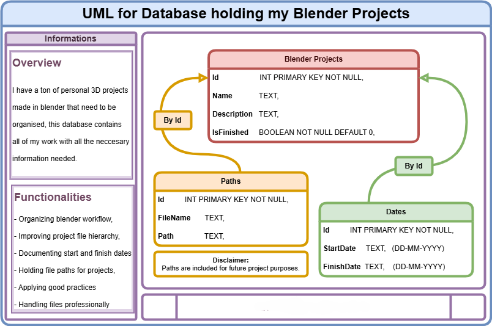

---

# Blender Projects Manager

[](https://www.python.org/downloads/release/python-380/)
[](https://www.sqlalchemy.org/)
[](https://github.com/RedFantom/ttkthemes)

[](https://blender.com)


---


## Table of Contents

- [Blender Projects Manager](#blender-projects-manager)
  - [Table of Contents](#table-of-contents)
  - [TL;DR](#tldr)
  - [Introduction](#introduction)
  - [Dependencies](#dependencies)
  - [Database Description in Context of App Usage](#database-description-in-context-of-app-usage)
  - [ERD Diagram](#erd-diagram)
  - [ORM Implementation with SQLAlchemy](#orm-implementation-with-sqlalchemy)
  - [CRUD Operations](#crud-operations)
    - [Create Operations](#create-operations)
    - [Read Operations](#read-operations)
    - [Update Operations](#update-operations)
    - [Delete Operations](#delete-operations)

## TL;DR

This project is a Blender Projects Manager application built with Python using `tkinter` for the GUI and SQLAlchemy for ORM. The application allows users to manage Blender projects, their associated file paths, and relevant dates through a user interface.


---

## Introduction

The Blender Projects Manager is an intuitive desktop application designed specifically for managing and organizing Blender 3D projects. If you are a 3D artist or a hobbyist who works extensively with Blender, you likely have numerous projects, each containing multiple files and associated data. Keeping track of these projects, their paths, and relevant dates can be cumbersome. This application aims to alleviate this challenge by providing a seamless way to manage all your Blender projects in one place.

### Key Features:

- **Project Organization**: Easily manage your Blender projects by adding, updating, and deleting projects from a centralized interface.
- **File Path Management**: Keep track of all file paths associated with each project, ensuring that you always know where your files are stored.
- **Date Tracking**: Document the start and finish dates for each project, allowing you to monitor your project timelines and deadlines.
- **Modern Interface**: The application features a modern dark-themed interface with a sleek and intuitive design, making it visually appealing and easy to use.
- **Cross-Platform**: Built with Python and `tkinter`, the application is cross-platform and can run on Windows, macOS, and Linux.

### Purpose:

The primary goal of the Blender Projects Manager is to provide a dedicated tool for managing Blender projects, addressing the following needs:

1. **Centralized Management**: Consolidate all your project details, file paths, and dates in one application.
2. **Enhanced Organization**: Improve the hierarchy and structure of your Blender projects, making it easier to navigate and manage.
3. **Time Tracking**: Keep track of when projects start and finish, which is crucial for planning and meeting deadlines.
4. **Best Practices**: Encourage and facilitate the adoption of best practices in project management, ensuring your Blender projects are well-organized and maintained.

### How It Works:

The application uses SQLAlchemy to handle database operations and `tkinter` for the graphical user interface. The database consists of three main tables: `BlenderProject`, `Path`, and `Date`. These tables store all necessary information about your projects, including names, descriptions, file paths, and dates. The GUI provides an intuitive way to interact with the database, allowing you to perform CRUD (Create, Read, Update, Delete) operations with ease.

Overall, the Blender Projects Manager is an essential tool for any Blender user looking to streamline their workflow and maintain an organized project library. Whether you are working on a single project or managing dozens of them, this application provides the features and functionalities you need to stay organized and efficient.
## Dependencies

To run this project, you need the following dependencies:
- Python 3.8+
- SQLAlchemy 1.4.0+
- ttkthemes 3.2.0+
- tkinter (usually included with Python)

Install the required dependencies using:
```sh
pip install sqlalchemy ttkthemes
```

## Database Description in Context of App Usage

The database for this application is designed to manage Blender projects. It consists of three tables: `BlenderProject`, `Path`, and `Date`. The `BlenderProject` table stores the main project details, while the `Path` table holds file paths related to the projects, and the `Date` table records the start and finish dates for each project.

- **BlenderProject**: Stores project details like name, description, and completion status.
- **Path**: Contains file paths associated with each project.
- **Date**: Records the start and finish dates for each project.

---


## ERD Diagram

Below is the Entity-Relationship Diagram (ERD) showing the relationships between the tables:



## ORM Implementation with SQLAlchemy

The following code defines the SQLAlchemy ORM models for the database:

```python
from sqlalchemy import create_engine, Column, Integer, String, Boolean, ForeignKey
from sqlalchemy.ext.declarative import declarative_base
from sqlalchemy.orm import sessionmaker, relationship

Base = declarative_base()

class BlenderProject(Base):
    __tablename__ = 'blender_projects'
    
    id = Column(Integer, primary_key=True, autoincrement=True)
    name = Column(String, nullable=False)
    description = Column(String)
    is_finished = Column(Boolean, nullable=False, default=False)
    
    paths = relationship('Path', back_populates='project', cascade="all, delete-orphan")
    dates = relationship('Date', back_populates='project', cascade="all, delete-orphan")

class Path(Base):
    __tablename__ = 'paths'
    
    id = Column(Integer, primary_key=True, autoincrement=True)
    file_name = Column(String)
    path = Column(String)
    project_id = Column(Integer, ForeignKey('blender_projects.id'))
    
    project = relationship('BlenderProject', back_populates='paths')

class Date(Base):
    __tablename__ = 'dates'
    
    id = Column(Integer, primary_key=True, autoincrement=True)
    start_date = Column(String)
    finish_date = Column(String)
    project_id = Column(Integer, ForeignKey('blender_projects.id'))
    
    project = relationship('BlenderProject', back_populates='dates')

# Database setup
engine = create_engine('sqlite:///blender_projects.db')
Base.metadata.create_all(engine)

Session = sessionmaker(bind=engine)
session = Session()
```

---


## CRUD Operations

### Create Operations

Adding a new project, path, and date:

```python
def add_project(self):
    name = self.project_name_var.get()
    description = self.project_description_var.get()
    is_finished = self.project_is_finished_var.get()
    if name:
        new_project = BlenderProject(name=name, description=description, is_finished=is_finished)
        session.add(new_project)
        session.commit()
        self.populate_project_tree()
    else:
        messagebox.showerror("Error", "Name cannot be empty")

def add_path(self):
    file_name = self.path_file_name_var.get()
    path = self.path_path_var.get()
    project_id = self.path_project_id_var.get()
    new_path = Path(file_name=file_name, path=path, project_id=project_id)
    session.add(new_path)
    session.commit()
    self.populate_path_tree()

def add_date(self):
    start_date = self.date_start_date_var.get()
    finish_date = self.date_finish_date_var.get()
    project_id = self.date_project_id_var.get()
    new_date = Date(start_date=start_date, finish_date=finish_date, project_id=project_id)
    session.add(new_date)
    session.commit()
    self.populate_date_tree()
```

### Read Operations

Reading all projects, paths, and dates:

```python
def populate_project_tree(self):
    for i in self.project_tree.get_children():
        self.project_tree.delete(i)
    projects = session.query(BlenderProject).all()
    for project in projects:
        self.project_tree.insert('', 'end', values=(project.id, project.name, project.description, project.is_finished))

def populate_path_tree(self):
    for i in self.path_tree.get_children():
        self.path_tree.delete(i)
    paths = session.query(Path).all()
    for path in paths:
        self.path_tree.insert('', 'end', values=(path.id, path.file_name, path.path, path.project_id))

def populate_date_tree(self):
    for i in self.date_tree.get_children():
        self.date_tree.delete(i)
    dates = session.query(Date).all()
    for date in dates:
        self.date_tree.insert('', 'end', values=(date.id, date.start_date, date.finish_date, date.project_id))
```

### Update Operations

Updating a project, path, and date:

```python
def update_project(self):
    selected_item = self.project_tree.selection()[0]
    item = self.project_tree.item(selected_item)
    project_id = item['values'][0]
    project = session.query(BlenderProject).filter_by(id=project_id).first()
    project.name = self.project_name_var.get()
    project.description = self.project_description_var.get()
    project.is_finished = self.project_is_finished_var.get()
    session.commit()
    self.populate_project_tree()

def update_path(self):
    selected_item = self.path_tree.selection()[0]
    item = self.path_tree.item(selected_item)
    path_id = item['values'][0]
    path = session.query(Path).filter_by(id=path_id).first()
    path.file_name = self.path_file_name_var.get()
    path.path = self.path_path_var.get()
    path.project_id = self.path_project_id_var.get()
    session.commit()
    self.populate_path_tree()

def update_date(self):
    selected_item = self.date_tree.selection()[0]
    item = self.date_tree.item(selected_item)
    date_id = item['values'][0]
    date = session.query(Date).filter_by(id=date_id).first()
    date.start_date = self.date_start_date_var.get()
    date.finish_date = self.date_finish_date_var.get()
    date.project_id = self.date_project_id_var.get()
    session.commit()
    self.populate_date_tree()
```

### Delete Operations

Deleting a project, path, and date:

```python
def delete_project(self):
    selected_item = self.project_tree.selection()[0]
    item = self.project_tree.item(selected_item)
    project_id = item['values'][0]
    project = session.query(BlenderProject).filter_by(id=project_id).first()
    session.delete(project)
    session.commit()
    self.populate_project_tree()

def delete_path(self):
    selected_item = self.path_tree.selection()[0]
    item = self.path_tree.item(selected_item)
    path_id = item['values'][0]
    path = session.query(Path).filter_by(id=path_id).first()
    session.delete(path)
    session.commit()
    self.populate_path_tree()

def delete_date(self):
    selected_item = self.date_tree.selection()[0]
    item = self.date_tree.item(selected_item)
    date_id = item['values'][0]
    date = session.query(Date).filter_by(id=date_id).first()
    session.delete(date)
    session.commit()
    self.populate_date_tree()
```

---


### Thanks for being here with me, peace and love - Daniil :v:
